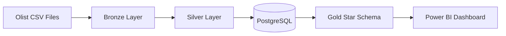

# Olist Retail Analytics

**Medallion Pipeline, PostgreSQL Star Schema & Power BI**

End-to-end retail analytics pipeline built using Python, PostgreSQL, SQL and Power BI, transforming approximately 100K Olist e-commerce orders through Bronze, Silver and Gold layers into a reporting-ready star schema.

> **Dashboard preview:** The Power BI report is included at [`dashboard/dashboard.pbix`](dashboard/dashboard.pbix). No suitable local screenshot was available, so a results image has intentionally not been fabricated. Add `dashboard/dashboard-preview.png` when an exported dashboard image is available.

## Project Overview

This project turns the multi-file Olist e-commerce dataset into a consistent analytical model. Python and Pandas preserve the source files in Bronze, clean and validate them in Silver, and build a Gold star schema in PostgreSQL. SQL examples demonstrate aggregation, category ranking, dimensional analysis, indexing and data-quality checks. Power BI consumes the Gold tables for reporting.

The completed pipeline produced 112,650 order-item fact rows. It is designed as a transparent portfolio example of data ingestion, quality validation, dimensional modelling and business-intelligence delivery—not as a claim of current commercial impact.

## Architecture



## Dataset

The project uses the [Brazilian E-Commerce Public Dataset by Olist](https://www.kaggle.com/datasets/olistbr/brazilian-ecommerce), which contains roughly 100K orders from 2016 to 2018 across customers, orders, order items, payments, reviews, products, sellers, geolocation and category translations.

The raw CSVs are intentionally excluded from Git. See [`data/README.md`](data/README.md) for download and placement instructions. Dataset rights remain with the original provider; the MIT License in this repository applies only to the source code and documentation.

## Tech Stack

- Python and Pandas for ingestion, transformation and validation
- PostgreSQL for the Silver and Gold schemas
- SQLAlchemy and psycopg2 for database loading
- SQL for constraints, analysis, indexing and query-plan inspection
- Power BI and DAX for reporting

## Data Pipeline

### Bronze

`src/bronze.py` reads the local Olist CSVs, preserves source values and adds two ingestion metadata columns:

- `load_date`
- `file_name`

A local load-date marker prevents unchanged files from being processed again. Bronze outputs and the marker are generated locally and excluded from Git.

### Silver

`src/silver.py` cleans, standardises and validates the Bronze data before replacing tables in PostgreSQL's `silver` schema. Transformations include text normalisation, timestamp parsing, lifecycle checks, composite-key validation, exact geolocation deduplication and product-category translation.

Most Portuguese product categories are translated using the supplied lookup. Two missing lookup values use documented fallbacks:

| Source category | English fallback |
|---|---|
| `pc_gamer` | `gaming_pc` |
| `portateis_cozinha_e_preparadores_de_alimentos` | `portable_kitchen_and_food_preparation_appliances` |

Products without an original category remain missing in the transformed data. Analysis queries may present those values as `unknown` without changing the underlying tables.

### Gold

`src/gold.py` reads the Silver tables and creates a reporting-ready star schema in PostgreSQL's `gold` schema. The fact-table grain remains **one row per order item**, preventing order-level measures from being silently duplicated.

## Data Quality

The pipeline preserves legitimate missing values rather than guessing replacements. Key decisions and checks include:

- Parsing and validating order lifecycle timestamps
- Flagging delivered orders with missing lifecycle dates while retaining valid missing dates for cancelled or incomplete orders
- Dataset duplicate checks and exact duplicate geolocation removal
- Composite-key validation for order items using `order_id + order_item_id`
- Composite-key validation for payments using `order_id + payment_sequential`
- Review uniqueness checks using `review_id + order_id`
- Product measurement and geolocation coordinate validation
- Product-category English translation with two explicit fallbacks
- Cross-table referential-integrity checks

The completed relationship checks returned no orphaned records for:

- Orders → Customers
- Order Items → Orders
- Order Items → Products
- Order Items → Sellers
- Payments → Orders
- Reviews → Orders

## Star Schema

```text
                 dim_customer
                      |
dim_product ----- fact_sales ----- dim_seller
                      |
                   dim_date
```

### `gold.fact_sales`

Grain: one row per order item. Primary key: `(order_id, order_item_id)`.

Important columns: `order_id`, `order_item_id`, `customer_id`, `product_id`, `seller_id`, `date_key`, `price`, `freight_value`, `item_total`, `order_status`, `delivery_days`.

### Dimensions

| Table | Key columns and attributes |
|---|---|
| `dim_customer` | `customer_id`, `customer_unique_id`, `customer_city`, `customer_state` |
| `dim_product` | `product_id`, `product_category_name`, `product_category_name_english`, `product_weight_g` |
| `dim_seller` | `seller_id`, `seller_city`, `seller_state` |
| `dim_date` | `date_key`, `full_date`, `day`, `month`, `month_name`, `quarter`, `year` |

Payments and reviews are not joined directly into `fact_sales` because they have different grains and could duplicate order-item rows.

## SQL Analysis

[`sql/analysis.sql`](sql/analysis.sql) contains approachable PostgreSQL examples for:

- Category sales using `SUM`, `GROUP BY` and `ORDER BY`
- Category ranking with `RANK() OVER (ORDER BY sales_value DESC)`
- Joining `fact_sales`, `dim_product` and `dim_date` for sales over time
- Creating an index on `gold.fact_sales(date_key)` and comparing `EXPLAIN ANALYZE` plans
- Checking negative `price`, `freight_value` and `delivery_days` values

The completed index test used a PostgreSQL `Bitmap Index Scan`. The completed data-quality query returned `invalid_sales_rows = 0`.

[`sql/schema.sql`](sql/schema.sql) adds the Gold primary-key and foreign-key constraints after the tables are loaded.

## Power BI Dashboard

The included report connects to the Gold star schema and contains:

- Total Sales
- Orders
- Items Sold
- Average Order Value
- Sales Trend by Month
- Top Product Categories by Sales
- Sales by Customer State
- Year filter

Main DAX measures:

```DAX
Total Sales =
SUM('gold fact_sales'[price])
```

```DAX
Orders =
DISTINCTCOUNT('gold fact_sales'[order_id])
```

```DAX
Items Sold =
COUNTROWS('gold fact_sales')
```

```DAX
Average Order Value =
DIVIDE(
    [Total Sales],
    [Orders]
)
```

Total Sales uses product price; freight remains available separately and is not included in the measure.

## Key Results

- Approximately 100K historical e-commerce orders transformed
- 112,650 rows in the order-item-grain sales fact table
- No orphaned records in the six implemented Silver relationship checks
- No negative price, freight or delivery-day rows in the completed Gold quality query
- PostgreSQL used the date-key index through a Bitmap Index Scan in the tested plan
- Power BI model delivered four KPIs, three analysis visuals and a year filter

## Project Structure

```text
olist-retail-analytics/
├── src/
│   ├── bronze.py
│   ├── silver.py
│   └── gold.py
├── sql/
│   ├── schema.sql
│   └── analysis.sql
├── dashboard/
│   └── dashboard.pbix
├── data/
│   └── README.md
├── .env.example
├── .gitignore
├── LICENSE
├── README.md
└── requirements.txt
```

## How to Run

### 1. Create a virtual environment and install dependencies

```bash
python -m venv .venv
```

On Windows PowerShell:

```powershell
.\.venv\Scripts\Activate.ps1
pip install -r requirements.txt
```

### 2. Create PostgreSQL configuration

Create the database:

```sql
CREATE DATABASE olist;
```

Copy `.env.example` to `.env`, then enter your local PostgreSQL values. `.env` is ignored and must never be committed.

### 3. Download the data

Follow [`data/README.md`](data/README.md) and place the nine source CSVs in `data/raw/`.

### 4. Run the pipeline

Run each command from the repository root:

```bash
python src/bronze.py
python src/silver.py
python src/gold.py
```

### 5. Apply constraints and run the analysis

```bash
psql -U postgres -d olist -f sql/schema.sql
psql -U postgres -d olist -f sql/analysis.sql
```

### 6. Open Power BI

Open `dashboard/dashboard.pbix` and update the PostgreSQL data-source credentials for your local environment if prompted.

## Limitations

- The dataset covers historical Olist activity from 2016 to 2018 and does not describe current retail performance.
- Silver and Gold loads replace tables rather than performing production-grade incremental upserts.
- Payments and reviews remain outside the sales fact because their grains differ from order items.
- The Power BI file is included, but the repository does not yet contain an exported dashboard preview image.
- Pipeline execution requires a local PostgreSQL instance and a separately downloaded dataset.

## Future Improvements

- Add automated unit and data-contract tests
- Add structured logging and run summaries
- Implement incremental database loading
- Model payments and reviews at their own grains
- Add CI checks for Python syntax, SQL formatting and secret detection
- Export and add a dashboard preview image
